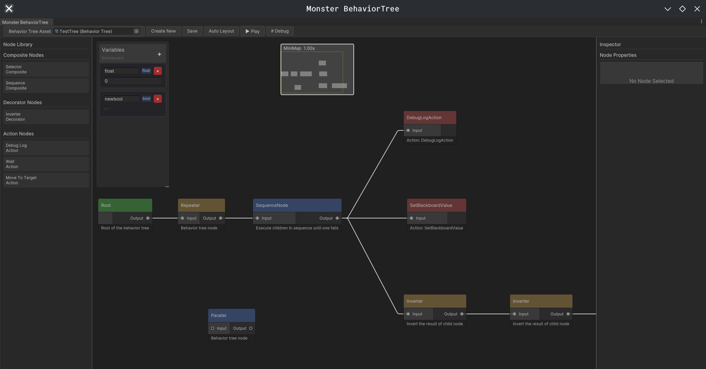

# TechCore-EnemyAI

一个基于Unity的NPC AI工具集合，为游戏开发者提供强大且易用的敌人AI解决方案。

## 🎯 项目概述

TechCore-EnemyAI 是一个模块化的AI工具框架，旨在为Unity游戏开发提供多种AI算法实现。

目前已实现功能丰富的 **行为树** 系统，后续将支持 **状态机** 、**GOAP** 等更多NPC AI工具。

## ✨ 核心功能

### 🌳 行为树系统 (MonsterBT)



#### 核心特性

- **完整的节点类型体系**：支持复合节点、装饰器节点、动作节点和条件节点
- **可视化编辑器**：基于UIElements的直观图形界面，支持拖拽创建和连接节点
- **黑板数据系统**：线程安全的数据共享机制，支持多种数据类型
- **运行时克隆**：支持行为树的运行时实例化，多个AI可共享同一行为树模板
- **可扩展架构**：模块化设计，易于添加自定义节点类型

#### 使用指南

##### 创建行为树

1. 在Project窗口右键选择 `Create > MonsterBT > BehaviorTree`
2. 创建对应的 `Create > MonsterBT > Blackboard`
3. 打开Window菜单中的"BT Editor"开始编辑

##### 运行行为树

```csharp
// 在游戏对象上添加BehaviorTreeRunner组件
var runner = gameObject.GetComponent<BehaviorTreeRunner>();
runner.BehaviorTree = yourBehaviorTreeAsset;
```

##### 扩展自定义节点

```csharp
[CreateAssetMenu(menuName = "MonsterBT/Action/CustomAction")]
public class CustomAction : ActionNode
{
    protected override BTNodeState OnUpdate()
    {
        // 实现你的逻辑
        return BTNodeState.Success;
    }
}
```

#### 节点类型

##### 复合节点 (Composite Nodes)

- **Selector（选择器）**：从左到右执行子节点，直到某个成功或全部失败
- **Sequence（序列器）**：从左到右执行子节点，直到某个失败或全部成功
- **Parallel（并行器）**：同时执行多个子节点
- **Random（随机器）**：随机选择一个子节点执行

##### 装饰器节点 (Decorator Nodes)

- **Inverter（反转器）**：反转子节点的执行结果
- **Repeater（重复器）**：重复执行子节点指定次数
- **Until（直到器）**：重复执行直到条件满足
- **ForceReturn（强制返回）**：强制返回指定状态

##### 条件节点 (Condition Nodes)

- **黑板条件检查**：支持Bool、Float、String、Vector3、GameObject类型
- **距离检查**：检测目标与自身的距离关系
- **范围检查**：检测数值是否在指定范围内

##### 动作节点 (Action Nodes)

- **调试输出**：用于调试的日志输出节点
- **移动到目标**：使AI移动到指定目标位置
- **等待**：暂停执行指定时间
- **设置黑板值**：修改黑板中的数据

#### 技术实现

##### 架构设计

```
BTNode（基类）
├── CompositeNode（复合节点基类）
├── DecoratorNode（装饰器节点基类）
├── ActionNode（动作节点基类）
└── RootNode（根节点）
```

##### 核心组件

- **BehaviorTree**：行为树ScriptableObject，包含树结构和黑板引用
- **BehaviorTreeRunner**：MonoBehaviour组件，负责运行时执行
- **Blackboard**：数据共享系统，支持类型安全的数据存储
- **BTNodeView**：编辑器节点视图，基于UIElements实现

##### 编辑器工具

- **BTEditorWindow**：行为树可视化编辑器主窗口
- **BTNodeGraphView**：节点图形视图，支持拖拽和连接
- **BTPropInspector**：属性检查器，用于编辑节点参数

## 🚀 未来计划

### 状态机系统 (MonsterFSM)

- 层次化状态机
- 状态转换条件
- 可视化状态图编辑器

### GOAP系统

- 目标导向的行动规划
- 动态行为生成
- 智能决策系统

### 通用AI工具

- AI感知系统
- 寻路集成
- 群体AI行为
- 性能优化工具

## 📋 系统要求

- Unity 2021.3 LTS 或更高版本
- .NET Standard 2.1

## 🤝 参与贡献

欢迎提交Issue和Pull Request来改进这个项目！

## 📄 许可证

本项目采用MIT许可证 - 详见 LICENSE 文件

---

⭐ 如果这个项目对你有帮助，别忘了给个Star！